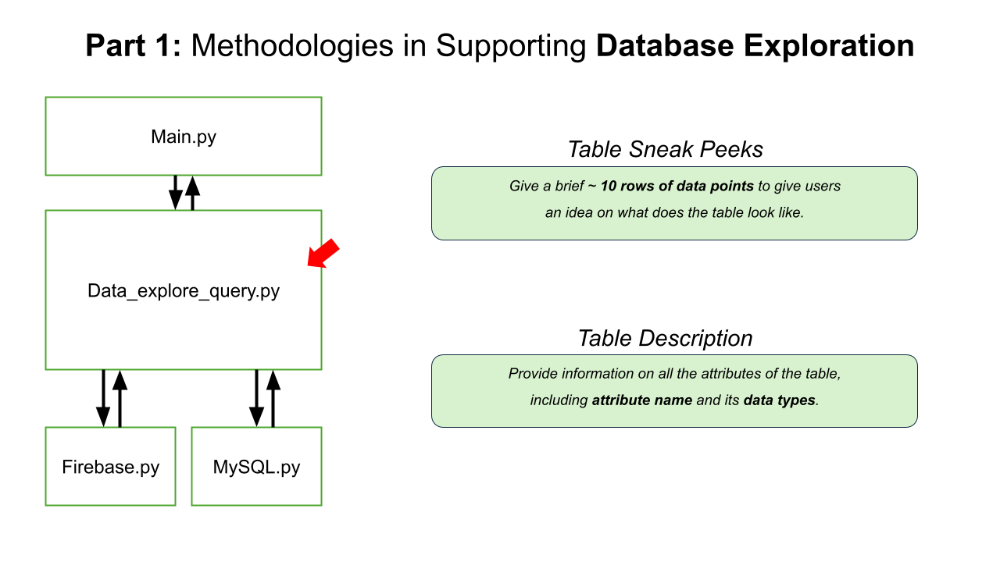
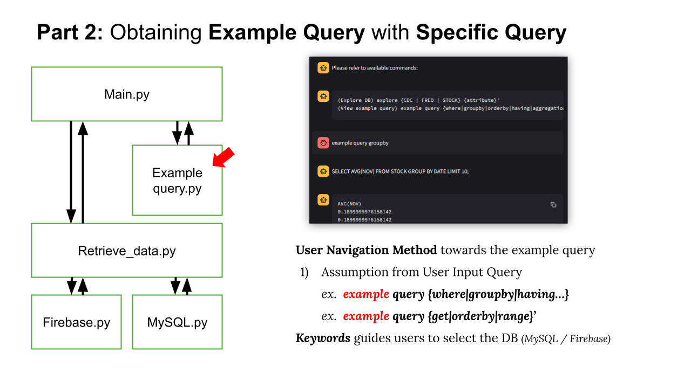
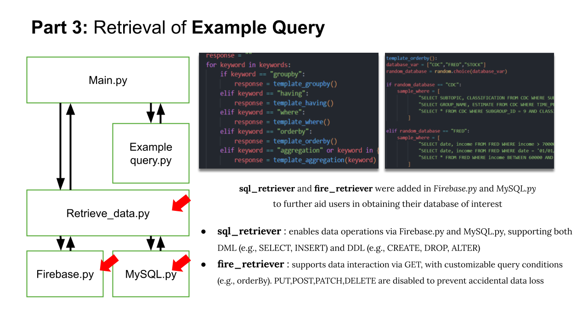
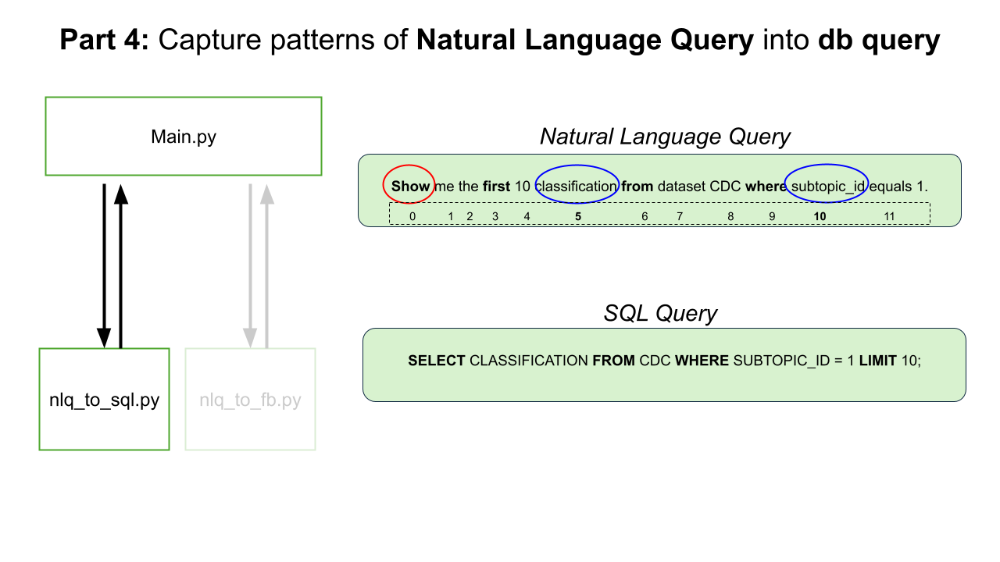
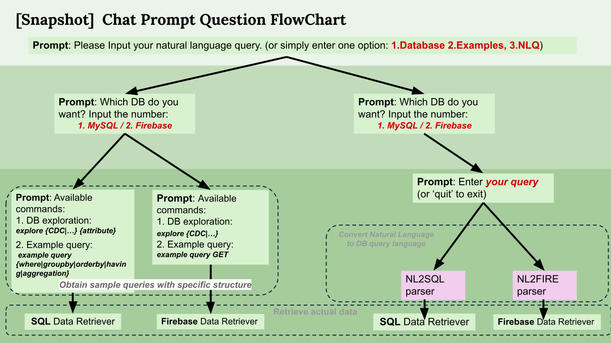

# DSCI 551 proj
DSCI_551 Database Management - CHATDB_39

## Archietecture 

 Click here to expand/collapse 

---
## How to use CHATDB
#### Step 1 : Clone this github repository
#### Step 2 : Turn on your terminal, set your the root directory of this repository as your current directory(cd). 
#### Step 3 : Type 'streamlit run streamlit.py' and you will see the streamlit running as on a localhost.

#### Step 4 : Utilize navigational questions. 
If you successfuly launched the streamlit, now go to page 2 to see the chatbox where you can associate with our ChatDB.  

Here is a snapshot that shows the flow of navigational questions from our ChatDB. By answering  specific keywords that match the pattern, users can move on to the next questions and get the result, whichever be database query or the retrieval outcome, at the end.

|Navigational Prompt|DB Exploration|Example DB Query|Natural Language to DB Language|
|---|---|---|---|
|Q1. Please choose an option: 1 (Database) 2 (Examples), 3 (NLQ)|Type one of: ***DB, database, 1***| Type one of : ***example(s), example query, 2*** | Type one of: ***nlq, 3*** |
|Q2. Which DB do you want? Input the number or name: 1. MySQL / 2.Firebase| Type one of: ***(my)sql, fire(base)*** | Type one of: ***(my)sql, fire(base)*** | Type one of: ***(my)sql, fire(base)*** |
|Q3. Type available commands | Type one of the table/collection of interest: ***explore {CDC\|STOCK\|FRED}*** | Type specific query of interest: (SQL) ***example query {where \| groupby\| orderby\| having\|aggregation}*** (FIREBASE) ***example query {get \| orderby \| range}*** | Please refer to 'How to generate response from natural language' 

 |

---
## How to generate response from natural language
|DB Language|Natural Language Query(NLQ)|
| --------- | -------------------- |
| SELECT | 'find', 'display', 'show', 'list', 'identify', 'retrieve', 'tell', 'calculate', 'select' |
| FROM | name of actual dataset |
| GROUP BY | closest attribute near <pattern> |
| AGGREGATION | 'count', 'sum', 'avg', 'min', 'max' |
| ORDER BY | 'ordered by', 'sorted by' + {'ascending','asc','increasing','up','descedning','desc'} |
| LIMIT | 'top', 'highest', 'lowest', 'only', 'limit' |
| WHERE | 'is greater than', 'is bigger than', 'is smaller than' |

Providing a unbreakable database query should take various information into consideration, such as data type of attributes and value distribution of attributes. To avoid this complexity between the nature of attributes and faultless database query, we offer samples of executable list of validated natural language queries.  

List of Executable NLQ

**( Note )** Table names and attribute names are case-sensitive.

> MySQL
1. "Display the sum of ESTIMATE grouped by GROUP_NAME in CDC;"
2. "List all NOV values from STOCK LIMIT 10;"
3. "Show top 5 income values from FRED;"
4. "Show me LLY FROM STOCK"

> Firebase 
1. show highest 5 Real_Median_Household_Income startat 50000 endat 70000 from FRED
2. show LLY startat 50 from STOCK
3. show LLY startat 50 and endat 100 from STOCK
4. show REAL_Median_Household_Income from FRED
5. show highest 5 Estimate in CDC 
6. show first 10 time_period_id from dataset CDC 

---
## Tech Stacks 
|Category|Item|Subitems|
|---|---|---|
|Databse|SQL|MySQL|
|Databse|NoSQL|Firebase Realtime Database|
|Development|Python|Library: pandas, random, re, json, pprint, pymysql, requests, time|
|Deployment|Streamlit|Library: streamlit| 

---
## Contributors
|Name|Contact|
|---|---|
|Hyuntae Roh|hroh@usc.edu|
|Jing Chuang|cchuang8@usc.edu|
|Hayong Son|hayoungs@usc.edu|
